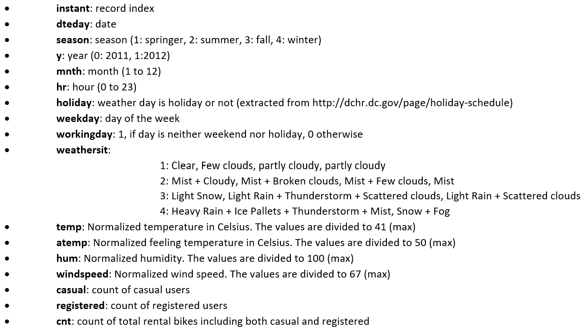

## Overview


- The data set is taken from UCI machine learning repository and related to the two-year historical log corresponding to years 2011 and 2012 from Capital Bikeshare system, Washington D.C., USA which is publicly available at http://capitalbikeshare.com/system-data. The data was aggregated on two hourly and daily basis. Then the corresponding weather and seasonal information was added on to this data. Weather information are extracted from http://www.freemeteo.com. The data set contains two csv files, one for hourly data and one for daily data. The variables (columns) in each data set are the same except the missing "hr" column in daily data.

- 'day' csv file is 731 x 16 and that of the 'hour' file is 17379 x 17.

- The dataset was checked for any missing values (NAs) and both the files had no missing data in them.


## Description of variables




The variables 'temp', 'hum', 'windspeed' are not normally distributed as will be shown in EDA.


## Underlying scientific processes that may affect the data


Underlying scientific processes that might have affected the data would be the occurrence of natural events like Hurricane Sandy on Oct 30, 2012. So, at instances where data might seem aberrant, it might be because the count of bike users was affected by these natural events or anomalies. There should be no reason why data should vary for any reason other than this.


## Probable questions to answer


```{r echo=FALSE}
df <- data.frame(Number = c("Question 1", "Question 2", "Question 3", "Question 4", "Question 5", "Question 6"),
Questions = c("Can we detect any anomalies or events that affect the rental count, such as holidays or weather events, using the data set?",
"Can we predict the future demand for bike rentals based on past data and environmental factors?",
"How does the demand for bike rentals differ between registered and casual users?",
"What is the impact of seasonal changes on bike rental demand?",
"How does the rental count of bikes vary with seasonal and environmental factors such as weather conditions, temperature, humidity, and wind speed?",
"Can we identify any patterns in the hourly rental counts, such as spikes during commuting hours?")
)

# Create table
knitr::kable(df)
```